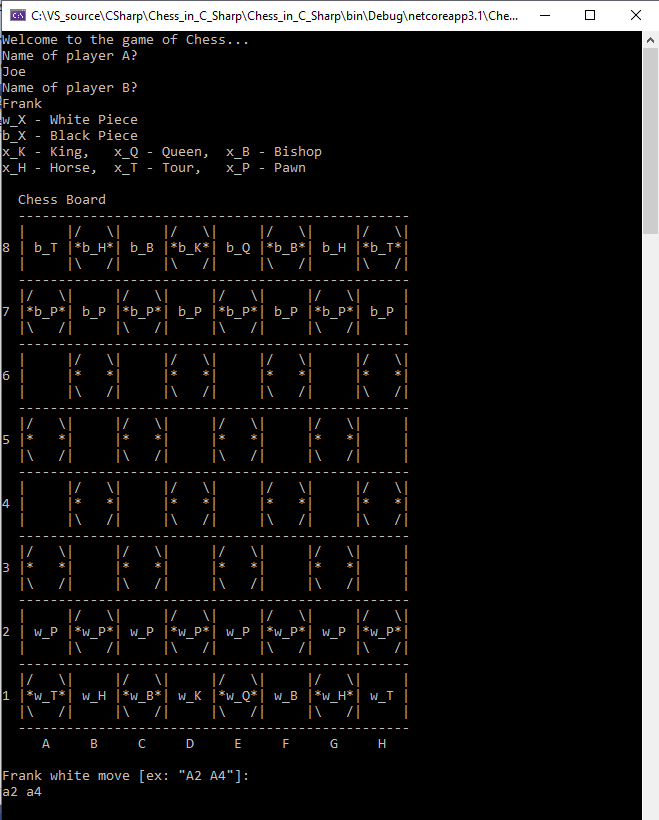

# A game of Chess in C Sharp
A game of chess for two players.

## Description
This is a game of chess made in the C Sharp programming language. In total it has 13 classes. But the logic is really simple, the only two more complex parts are the different moves of each piece and the detection of checkmate states. The main classes are a Board, Player and Piece. Then each different type of piece inherits from Piece. There are also some enum utils classes. 

## Screen shoot

## Motivation for this project
I made this simple project to play in a funny way chess with my daughter :-D.

## Todo
1 - There is a small bug that occur sometimes in the detection of checkmate. I will have to test it more to identify and correct the bug.

2 - The exchange of the pawn piece by a queen piece isn't implemented yet.

3 - The exchange of the position Tour with the King isn't implemented yet. 

## License
MIT Open Source License

## Have fun!
Best regards,  
Joao Nuno Carvalho  